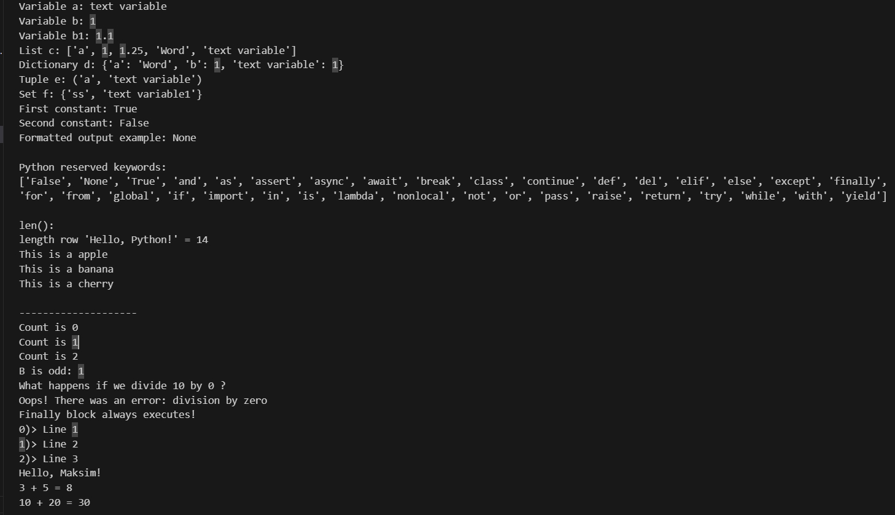
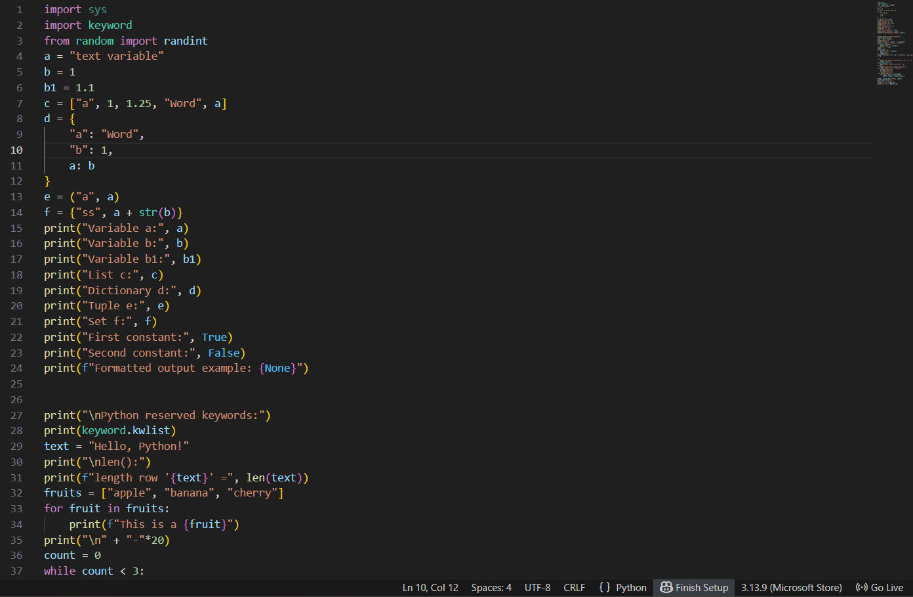

# Звіт до роботи
## Тема: Основи програмування Python
### Мета роботи:Навчитись застосовувати основні конструкції мови Python, виконати всі приклади та з використанням AI створити власні приклади, які демонструють особливості кодових конструкцій Pyhton


---
### Виконання роботи
* Результати виконання завдання *1-8*;
    1. Програма вивела значення: 
    1. Отримав наступні результати: Програма працює правильно,код спрацював у всіх методах виклику
    1. Ознайомився та навчився використовувати основні конструкціїї мови Python,виконкав всі поставлені завдання,а також створив приклади від ШІ,які демонструють особливості кодових конструкцій Python
* вставлені рисунки  
    
    

* вставлений код / текстовий або числовий результат / інші результати:
    - from datetime import datetime
name = "Maksim"
location = "Lviv"
print(f"{name} start programming at {datetime.now()}. {location} is the best city!");

* результати виконання індивідуального завдання (якщо такі є);

---

### Про основи програмування на Python від ШІ

> Запитання: Запитайте у АІ як би він розписав про основи Python (задайте промпт вказавши що ви вивчаєте Python з використанням Jupyter Notebook). Спробуйте виконати приклади Python коду та вставте їх відповіді у звіт?

```
1️⃣ Змінні та типи даних

Python — динамічно типізована мова, тобто змінні не потребують явного оголошення типу.

# Числові типи
a = 10        # int
b = 3.14      # float

# Рядки
name = "Maksim"

# Булеві
is_active = True

# Вивід типу
print(type(a), type(b), type(name), type(is_active))


Основні типи: int, float, str, bool, list, tuple, dict, set.

2️⃣ Списки, кортежі, словники, множини
# List — змінний список
fruits = ["apple", "banana", "cherry"]
fruits.append("orange")  # додаємо елемент

# Tuple — незмінний
coords = (10, 20)

# Dict — словник ключ:значення
person = {"name": "Alice", "age": 25}

# Set — множина, унікальні елементи
unique_numbers = {1, 2, 3, 2}

print(fruits, coords, person, unique_numbers)

3️⃣ Оператори та умовні конструкції
x = 10
y = 5

# Арифметика
print(x + y, x - y, x * y, x / y, x // y, x % y, x ** 2)

# Умови
if x > y:
    print("x > y")
elif x == y:
    print("x == y")
else:
    print("x < y")

4️⃣ Цикли
# for
for i in range(5):
    print(i)

# while
count = 0
while count < 3:
    print("Count:", count)
    count += 1

5️⃣ Функції та лямбда
# Звичайна функція
def greet(name):
    return f"Hello, {name}!"

print(greet("Maksim"))

# Лямбда
add = lambda x, y: x + y
print(add(5, 3))

6️⃣ Вбудовані функції
print(abs(-10))       # абсолютне значення
print(len("Python"))  # довжина рядка
print(round(3.14159, 2))  # округлення

7️⃣ Робота з файлами (контекст-менеджер)
# Запис у файл
with open("example.txt", "w") as f:
    f.write("Hello\nWorld\n")

# Читання з файлу
with open("example.txt", "r") as f:
    for line in f:
        print(line.strip())

8️⃣ Обробка помилок
try:
    result = 10 / 0
except ZeroDivisionError as e:
    print("Error:", e)
finally:
    print("Always executes")

9️⃣ Коментарі та магія Jupyter
# Це однорядковий коментар

"""
Це
багаторядковий
коментар
"""
```
### Висновок:
> ---

## 1. Що зроблено в роботі
- Вивчено основні типи даних: `int`, `float`, `str`, `bool`, `list`, `tuple`, `dict`, `set`.  
- Попрактикувались у роботі з умовними конструкціями (`if`, `elif`, `else`).  
- Виконано приклади циклів `for` та `while`.  
- Ознайомились з лямбда-функціями та вбудованими функціями (`abs`, `len`, `round`).  
- Реалізовано приклади роботи з файлами через контекст-менеджер `with`.  
- Відпрацьовано конструкції обробки помилок `try → except → finally`.  
- Використано AI для створення власних прикладів коду для демонстрації можливостей Python.  

## 2. Чи досягнуто мети роботи
Так, мета роботи досягнута: освоєні базові конструкції Python, створені власні приклади та виконані всі завдання.  

## 3. Які нові знання отримано
- Розуміння основних типів даних та структур у Python.  
- Навички роботи з циклами та умовними конструкціями.  
- Вміння створювати та використовувати лямбда-функції.  
- Знання про обробку помилок і роботу з файлами.  
- Практика інтеграції AI для створення кодових прикладів.  

## 4. Чи вдалося відповісти на всі питання, задані в ході роботи
Так, всі питання щодо типів даних, циклів, умовних конструкцій, функцій та обробки помилок були опрацьовані.  

## 5. Чи вдалося виконати всі завдання
Так, всі лабораторні приклади та додаткові завдання було виконано.  

## 6. Чи виникли складності у виконанні завдання
- Лише на початку були невеликі труднощі з імпортом функцій (`randint`) та синтаксисом лямбда-функцій.  
- Всі проблеми були успішно усунені.  

## 7. Чи подобається такий формат здачі роботи (Feedback)
Так, формат з поетапним виконанням прикладів у Jupyter Notebook та використанням AI для генерації власних прикладів дуже зручний і наочний.  

## 8. Побажання для покращення (Suggestions)
- Додати більше практичних завдань на комбінування різних конструкцій (цикли + умовні оператори + словники).  
- Включати короткі пояснення для кожного прикладу прямо в ноутбуку для кращого розуміння.  
- Додати вправи на використання модулів і бібліотек Python для практики реальних задач.
