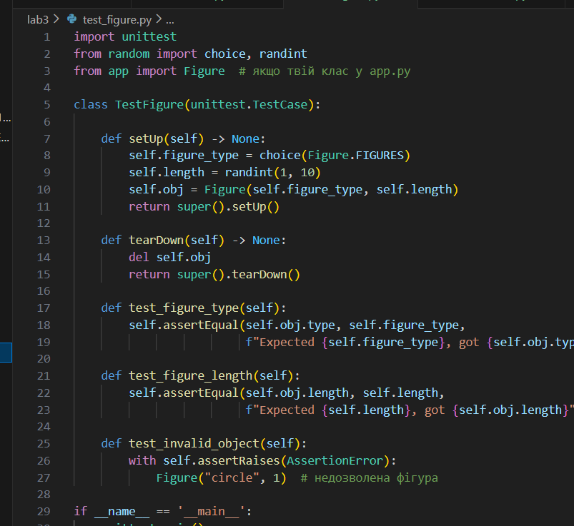
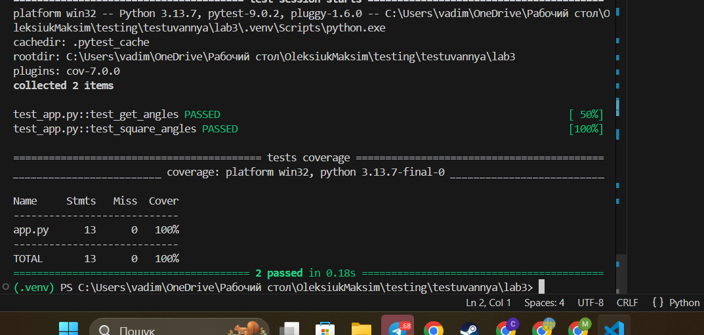

# Звіт до роботи
## Тема:Тестування програм (UnitTests та PyTests)

### Мета роботи:Ознайомитися з методами тестування програмного забезпечення, зокрема з юнит-тестами (UnitTests) та PyTest, навчитись створювати автоматизовані тести для окремих частин коду, перевіряти правильність виконання функцій і поведінку програм при різних умовах. Вивчити використання інструментів для збору статистики покриття коду тестами (coverage) та підготувати код до подальшої автоматизації тестування з допомогою CI/CD систем, таких як GitHub Actions.

---
### Виконання роботи
* Результати виконання завдання *3*;
    1. Програма вивела значення:
    1. Отримав наступні результати: Програма працює правильно,код спрацював у всіх методах виклику
    1. Ознайомився та навчився використовувати основні конструкціїї мови Python,виконкав всі поставлені завдання,а також створив приклади від ШІ,які демонструють особливості кодових конструкцій Python
* вставлені рисунки     
      4 завдання(останнє до автоматизації) 
    

* вставлений код / текстовий або числовий результат / інші результати:
    - 
class Figure:
    FIGURES = ["square", "rectangle", "triangle"]

    def __init__(self, type, length) -> None:
        assert length > 0, "Length must be greater than 0!"
        assert type in self.FIGURES, "Allowed figures: square, rectangle, triangle"
        self.type = type
        self.length = length

    @property
    def get_angles(self):
        if self.type in ["square", "rectangle"]:
            return 4
        if self.type == "triangle":
            return 3

* результати виконання індивідуального завдання (якщо такі є);

---
### Висновок:
---

## 1. Що зроблено в роботі
- Ознайомлено з основами тестування програмного забезпечення.
- Створено власні класи (`Figure`, `Name`) для практики перевірки даних.
- Реалізовано валідацію даних за допомогою `assert` та `raise ValueError`.
- Написано та виконано юніт-тести з використанням бібліотеки `unittest`.
- Ознайомлено з тестуванням через `PyTest` та запуском тестів у терміналі VS Code.
- Використано `coverage` / `pytest-cov` для збору статистики покриття коду тестами.
- Додано нові проперті (`get_angles`) і протестовано їх роботу через юніт-тести.
- Практично відпрацьовано запуск тестів, збір покриття та генерацію HTML-звітів.

## 2. Чи досягнуто мети роботи
Так, мета роботи досягнута: освоєно методи тестування програмного коду, написано та виконано тести, отримано звіти про покриття коду.

## 3. Які нові знання отримано
- Розуміння принципів юніт-тестування та автоматизованої перевірки коду.
- Навички роботи з бібліотеками `unittest` та `pytest`.
- Вміння збирати статистику покриття коду через `coverage` і формувати HTML-звіти.
- Розуміння методів валідації даних у класах за допомогою `assert` та `ValueError`.
- Практичні навички організації тестів та їх запуску у VS Code та терміналі.

## 4. Чи вдалося відповісти на всі питання, задані в ході роботи
Так, всі питання щодо створення тестів, перевірки даних та покриття коду були опрацьовані.

## 5. Чи вдалося виконати всі завдання
Так, всі лабораторні приклади, тести та додаткові завдання були виконані.

## 6. Чи виникли складності у виконанні завдання
- На початку були труднощі з налаштуванням віртуального середовища та встановленням бібліотек `pytest` і `coverage`.
- Проблеми з імпортом класів та старими `.pyc` файлами успішно усунені.

## 7. Чи подобається такий формат здачі роботи (Feedback)
Так, формат із поетапним написанням коду, тестів та збором покриття через HTML-звіт зручний і наочний.

## 8. Побажання для покращення (Suggestions)
- Додати більше практичних завдань на створення класів і їх тестування.
- Інтегрувати приклади автоматизації тестів через GitHub Actions для повного циклу CI/CD.
- Додати вправи на комбінування `assert`, `unittest` та `pytest` для різних сценаріїв перевірки.
