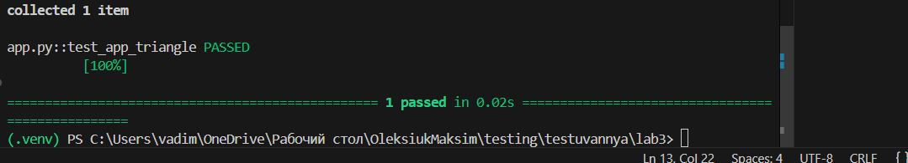
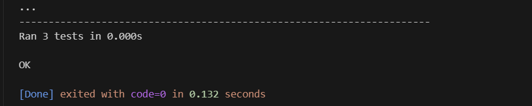

# Звіт до роботи
## Тема:Тестування програм (UnitTests та PyTests)

### Мета роботи:Ознайомитися з методами тестування програмного забезпечення, зокрема з юнит-тестами (UnitTests) та PyTest, навчитись створювати автоматизовані тести для окремих частин коду, перевіряти правильність виконання функцій і поведінку програм при різних умовах. Вивчити використання інструментів для збору статистики покриття коду тестами (coverage) та підготувати код до подальшої автоматизації тестування з допомогою CI/CD систем, таких як GitHub Actions.

---
### Виконання роботи
* Результати виконання завдання *3*;
    1. 
    1. Отримав наступні результати: Програма працює правильно,код спрацював у всіх методах виклику,всі класи працюють
    1. Ознайомився та навчився використовувати основні конструкціїї мови Python,виконкав всі поставлені завдання,а також створив приклади від ШІ,які демонструють особливості кодових конструкцій Python
* вставлені рисунки     
      4 завдання(останнє до автоматизації) 
    

* вставлений код / текстовий або числовий результат / інші результати:

from app import Figure

def test_get_angles():
    fig = "triangle"
    triangle = Figure(fig, 1)
    assert triangle.get_angles == 3

def test_square_angles():
    fig = "square"
    square = Figure(fig, 2)
    assert square.get_angles == 4

* результати виконання індивідуального завдання (якщо такі є);

---
### Висновок:
---

## 1. Виконана робота

- Вивчено базові поняття та підходи до тестування програмного забезпечення.
- Розроблено власні класи (`Figure`, `Name`) для відпрацювання перевірки коректності даних.
- Реалізовано механізми валідації з використанням `assert` та викликів `raise ValueError`.
- Створено та виконано юніт-тести за допомогою бібліотеки `unittest`.
- Розглянуто можливості тестування з використанням `PyTest` і запуск тестів через термінал VS Code.
- Застосовано інструменти `coverage` / `pytest-cov` для аналізу покриття коду тестами.
- Додано нові властивості (зокрема `get_angles`) та перевірено їх коректність за допомогою тестів.
- Практично відпрацьовано процес запуску тестів, збору покриття та створення HTML-звітів.

## 2. Досягнення мети роботи

Так, поставлену мету досягнуто: опановано основи тестування програмного коду, створено та виконано тести, а також отримано звіти про рівень покриття.

## 3. Отримані знання та навички

- Засвоєно принципи юніт-тестування та автоматизованої перевірки програм.
- Набуто досвіду роботи з бібліотеками `unittest` і `pytest`.
- Отримано навички збору статистики покриття коду за допомогою `coverage` та формування HTML-звітів.
- Поглиблено розуміння методів перевірки даних у класах із використанням `assert` і `ValueError`.
- Практично освоєно організацію та запуск тестів у середовищі VS Code та через термінал.

## 4. Відповіді на питання, поставлені під час виконання роботи

Так, усі питання, що стосувалися створення тестів, валідації даних та аналізу покриття коду, були розглянуті та опрацьовані.

## 5. Виконання всіх завдань

Так, усі лабораторні приклади, тестові сценарії та додаткові завдання були виконані у повному обсязі.

## 6. Труднощі під час виконання роботи

- На початковому етапі виникли складнощі з налаштуванням віртуального середовища та встановленням бібліотек `pytest` і `coverage`.
- Проблеми з імпортом класів та наявністю застарілих `.pyc` файлів були успішно вирішені.

## 7. Оцінка формату здачі роботи (Feedback)

Так, такий формат виконання та здачі роботи є зручним і наочним, оскільки дозволяє поетапно відстежувати написання коду, тестів і аналіз покриття через HTML-звіт.

## 8. Пропозиції щодо покращення (Suggestions)

- Доцільно додати більше практичних завдань, спрямованих на створення класів і написання тестів до них.
- Варто інтегрувати приклади автоматизації тестування з використанням GitHub Actions для демонстрації CI/CD-процесів.
- Запропонувати вправи, що поєднують використання `assert`, `unittest` і `pytest` у різних сценаріях перевірки.

