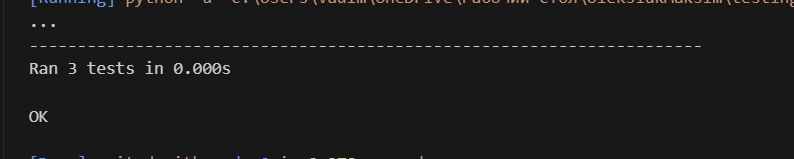

# Білет 17
Завдання: У файлі main.py напишіть функцію is_adult(age: int), яка повертає True, якщо вік >= 18. Тест: У файлі test.py перевірте значення 17, 18 та 19
## Виконання
- запускаємо програму:
  ```bash
  python test.py
  ```
- запускаю тести:
- результат
